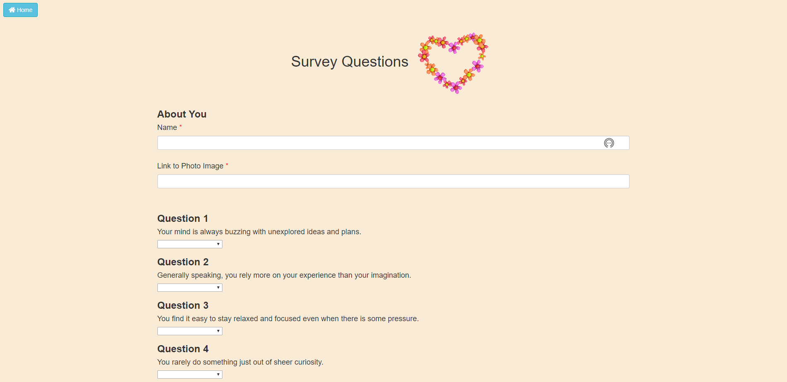

# Friend-Finder

<h1>:sparkling_heart:Friend Finder!</h1>

<h3>Overview</h3> 
In this activity, build a compatibility-based "FriendFinder" application, basically a dating app. This full-stack site will take in results from users' surveys, then compare their answers with those from other users. The app will then display the name and picture of the user with the best overall match.

<h3>Built With</h3>

<ul>
<li>JavaScript</li>
<li>jQuery</li>
<li>Node.js</li>
<li>AJAX</li>
<li>Express</li>
<li>HTML</li>
</ul>

<h3>Home Page</h3>

<h3>Survey Page</h3>

<h3>Missing Required Information</h3>

<h3>Your Most Compatible Friend</h3>

